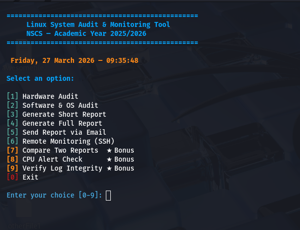
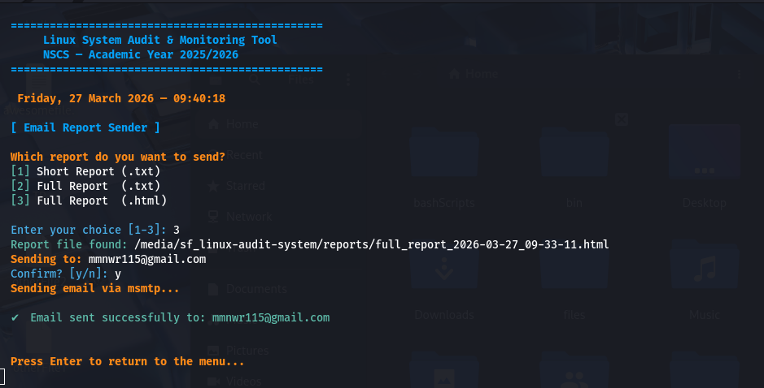
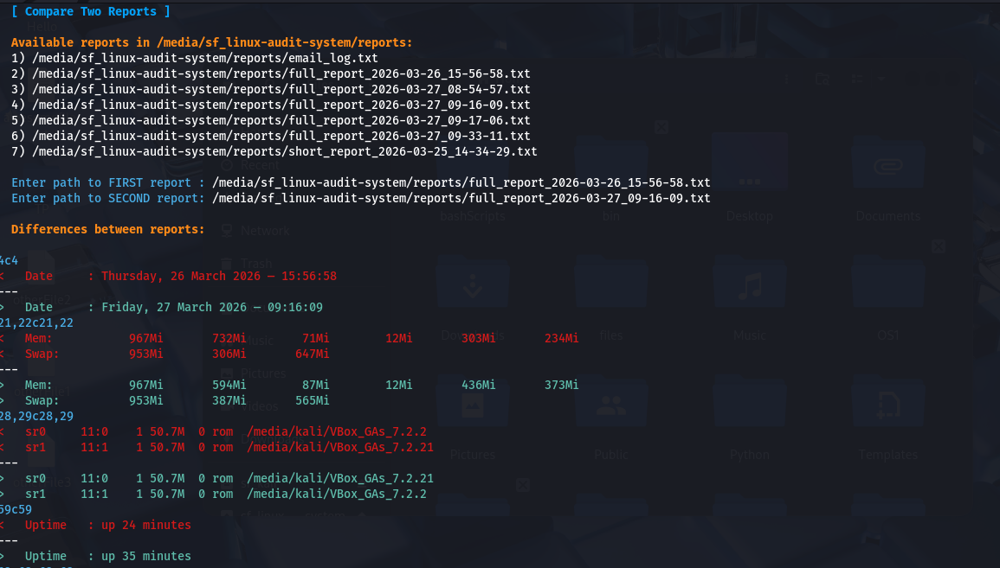
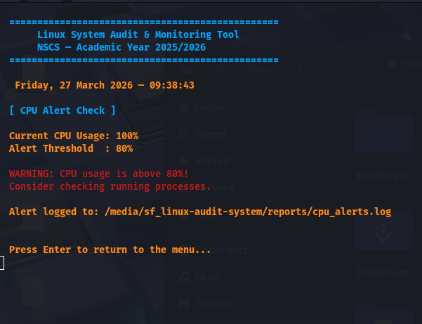

# 🛡️ Linux System Audit & Monitoring Tool

> **Mini-Project Part 1** — National School of Cyber Security (NSCS), Algeria  
> **Course:** Operating Systems (Foundation Training) | **Academic Year:** 2025/2026  
> **Supervisor:** Dr. BENTRAD Sassi  
> **Developed by:** Akeb Abdelkarim & Kerd Abderrahim  
> **Submission Date:** March 30, 2026

A fully automated Linux system audit and monitoring solution built with pure Bash scripting. The tool collects hardware and software information, generates multi-format reports, sends them via email, supports remote monitoring over SSH, and automates execution with cron jobs.

---

## 📋 Table of Contents

- [Features](#features)
- [Project Structure](#project-structure)
- [Requirements](#requirements)
- [Installation](#installation)
- [Configuration](#configuration)
- [Usage](#usage)
- [Report Formats](#report-formats)
- [Email Setup](#email-setup)
- [Remote Monitoring via SSH](#remote-monitoring-via-ssh)
- [Cron Automation](#cron-automation)
- [Bonus Features](#bonus-features)
- [Team & Contributions](#team--contributions)
- [License](#license)

---

## ✨ Features

| Feature | Description |
|---|---|
| 🖥️ Hardware Audit | CPU, GPU, RAM, Disk, USB, Motherboard info |
| 📦 Software Audit | OS, Kernel, packages, services, processes, open ports |
| 📄 Report Generation | Short & full reports in `.txt`, `.html`, `.json` |
| 📧 Email Delivery | Send reports via `msmtp`, `sendmail`, or `mail` |
| 🌐 Remote Monitoring | Live system info & report transfer via SSH/SCP |
| ⏰ Cron Automation | Schedule audits automatically |
| 🔄 Report Comparison | Detect changes between two report snapshots |
| ⚠️ CPU Alert | Alert when CPU usage exceeds a configurable threshold |
| 🔒 Log Integrity | Verify audit logs using `sha256sum` |
| 🎨 Colorized Terminal | ANSI color-coded interactive menu |

---

## 📁 Project Structure

```
linux-audit-system/
├── README.md
├── .gitignore
├── .gitattributes
├── scripts/
│   ├── main.sh               # Interactive menu — entry point
│   ├── auto_audit.sh         # Silent pipeline — called by cron
│   ├── hardware_audit.sh     # Hardware data collection
│   ├── software_audit.sh     # Software & OS data collection
│   ├── report_generator.sh   # Report generation (txt/html/json)
│   ├── email_sender.sh       # Email delivery via msmtp/sendmail
│   ├── remote_monitor.sh     # SSH-based remote monitoring & SCP transfer
│   ├── scheduler.sh          # Cron job setup and automation
│   └── utils.sh              # Shared colors, logging, error handling
├── config/
│   ├── audit.conf            # Main configuration (paths, thresholds)
│   └── email.conf            # Email configuration (SMTP, recipient)
├── reports/
│   ├── examples/
│   │   ├── example_short_report.txt
│   │   ├── example_full_report.html
│   │   └── example_full_report.json
│   └── .gitkeep
├── logs/
│   └── .gitkeep
├── docs/
│   ├── technical_report.pdf
│   ├── design_architecture.md
│   └── screenshots/
└── tests/
    ├── test_hardware.sh
    └── test_software.sh
```

---

## 🖥️ Requirements

- **OS:** Ubuntu 20.04+ or Kali Linux
- **Shell:** Bash 4.0+
- **Privileges:** Some commands require `sudo` (e.g., `dmidecode`)

### Core tools (standard on most Linux systems)
```
bash, coreutils, procps, iproute2, util-linux, net-tools/iproute2
systemd, lsblk, lsusb, lspci, df, free, top, ps, ss
```

### Optional tools (for extra functionality)
```bash
sudo apt install msmtp msmtp-mta    # Email sending
sudo apt install openssh-client     # Remote monitoring
sudo apt install pciutils           # GPU info (lspci)
sudo apt install usbutils           # USB info (lsusb)
```

---

## ⚙️ Installation

### 1. Clone the repository

```bash
git clone https://github.com/kariimdev/linux-audit-system.git
cd linux-audit-system
```

### 2. Make scripts executable

```bash
chmod +x scripts/*.sh
```

### 3. Configure the tool

Copy and edit the configuration file:

```bash
# Edit main config
nano config/audit.conf

# Edit email config
nano config/email.conf
```

### 4. Run the tool

```bash
bash scripts/main.sh
```

> **Note:** Run as root or with `sudo` to access full hardware information (e.g., `dmidecode` for motherboard details).

```bash
sudo bash scripts/main.sh
```

---

## 🔧 Configuration

### `config/audit.conf`

```bash
# Directory where reports are saved
REPORT_DIR="/var/log/sys_audit"

# CPU usage alert threshold (percentage)
CPU_THRESHOLD=80
```

### `config/email.conf`

```bash
EMAIL_RECIPIENT="recipient@gmail.com"
EMAIL_SENDER="your_sender@gmail.com"
SMTP_USER="your_sender@gmail.com"
SMTP_PASSWORD="your-app-password"
SMTP_HOST="smtp.gmail.com"
SMTP_PORT="587"
```

> The email sender automatically detects available tools in this priority order: `msmtp` → `sendmail` → `mail`.

---

## 🚀 Usage

Launch the interactive menu:

```bash
bash scripts/main.sh
```

You will be presented with the following menu:



```
  ================================================
       Linux System Audit & Monitoring Tool
       NSCS — Academic Year 2025/2026
  ================================================

  Select an option:

  [1] Hardware Audit
  [2] Software & OS Audit
  [3] Generate Short Report
  [4] Generate Full Report
  [5] Send Report via Email
  [6] Remote Monitoring (SSH)
  [7] Compare Two Reports  ★ Bonus
  [8] CPU Alert Check      ★ Bonus
  [9] Verify Log Integrity ★ Bonus
  [0] Exit
```

### Running Individual Scripts

You can also source and call individual modules:

```bash
# Run hardware audit
source scripts/utils.sh
source scripts/hardware_audit.sh
hardware_audit

# Generate a short report
source scripts/report_generator.sh
generate_short_report

# Send latest report via email
source scripts/email_sender.sh
send_report
```

---

## 📄 Report Formats

The tool generates three formats for full reports:

| Format | Filename Pattern | Description |
|---|---|---|
| `.txt` | `full_report_YYYY-MM-DD_HH-MM-SS.txt` | Plain text, terminal-friendly |
| `.html` | `full_report_YYYY-MM-DD_HH-MM-SS.html` | Styled dark-theme web page |
| `.json` | `full_report_YYYY-MM-DD_HH-MM-SS.json` | Machine-readable structured data |

Short reports are saved as `.txt` only:
```
short_report_YYYY-MM-DD_HH-MM-SS.txt
```

All reports are saved to the directory configured in `REPORT_DIR` (default: `/var/log/sys_audit`).

See [`reports/examples/`](reports/examples/) for sample outputs.

---

## 📧 Email Setup

The tool supports three email backends, detected automatically:

### Using `msmtp` (Recommended)

1. Install msmtp:
   ```bash
   sudo apt install msmtp msmtp-mta
   ```

2. Fill in your credentials in `config/email.conf`:
   ```bash
   EMAIL_RECIPIENT="recipient@gmail.com"
   EMAIL_SENDER="your_sender@gmail.com"
   SMTP_USER="your_sender@gmail.com"
   SMTP_PASSWORD="your-google-app-password"
   SMTP_HOST="smtp.gmail.com"
   SMTP_PORT="587"
   ```

3. Select option **[5]** from the main menu to send.

> **No manual `~/.msmtprc` file required!** The tool dynamically builds its own temporary configuration from `email.conf` at runtime and securely deletes it afterwards.

> **Gmail users:** Generate an [App Password](https://myaccount.google.com/apppasswords) — Google does not allow direct account password authentication over SMTP.



---

## 🌐 Remote Monitoring via SSH

Option **[6]** in the main menu enables:

1. **Live monitoring** — pulls CPU, memory, disk, logged-in users, processes, and open ports from a remote machine via SSH
2. **Report transfer** — copies the latest local report to the remote server via SCP
3. **Both** — performs monitoring then transfers the report

### Prerequisites

- SSH client installed: `sudo apt install openssh-client`
- SSH key-based authentication set up on the remote host:
  ```bash
  ssh-keygen -t ed25519 -C "audit-tool"
  ssh-copy-id user@remote_host_ip
  ```

### Usage

On launching option **[6]**, you will be prompted for:
- Remote username (e.g., `root` or `ubuntu`)
- Remote host IP address

The tool tests the connection first, then proceeds if successful. Reports are transferred to `/tmp/audit_reports/` on the remote server.

---

## ⏰ Cron Automation

Use `scripts/scheduler.sh` to automatically set up, manage, or remove the background cron job without having to touch the cron table yourself:

```bash
bash scripts/scheduler.sh setup   # Installs the automated job
bash scripts/scheduler.sh status  # Checks if the job is running
bash scripts/scheduler.sh remove  # Deletes the automation safely
```

### Manual cron setup

To run a full audit every day at 4:00 AM:

```bash
crontab -e
```

Add the following line:

```cron
0 4 * * * /bin/bash /path/to/linux-audit-system/scripts/auto_audit.sh >> /var/log/sys_audit/cron.log 2>&1
```


Cron execution is logged to `logs/audit.log`.

---

## 🛠️ Troubleshooting & FAQ

**Q: My cron job runs but no email is sent!**  
*A: Cron runs in a stripped-down environment where the `$PATH` variable is practically empty. If you installed `msmtp` locally, cron might not see it. Our script forces dynamic absolute paths just for this reason, so ensure your daemon is installed globally (`sudo apt install msmtp`).*

**Q: The script crashes when I select "Remote Monitoring (Option 6)".**  
*A: This feature explicitly requires passwordless SSH entry via `ed25519` or `rsa` keys. If your system still prompts you to type a password when you SSH into the target box, our script's strict `BatchMode=yes` flag will instantly reject the connection to prevent your terminal from freezing indefinitely.*

**Q: My HTML report renders as raw text in my inbox!**  
*A: If you manually tweaked the reporting engine, make sure you didn't accidentally delete the `MIME-Version: 1.0` and `Content-Type: text/html` HTTP headers. Without those exact wrappers underneath the Subject line, Gmail will immediately fallback to displaying raw bracket code.*

**Q: The audit log says "dmidecode requires root".**  
*A: The tool `dmidecode` reaches directly into the BIOS/UEFI DMI tables to pull proprietary Motherboard serial schemas. The Linux kernel actively blocks standard unprivileged users from reading this low-level memory block. Run the tool via `sudo` if you need this data.*

---

## 🌟 Bonus Features

### 🔄 Compare Two Reports (Option 7)

Compares two audit report files and highlights differences using `diff`. Useful for detecting configuration changes or new processes between audit runs.



### ⚠️ CPU Alert Check (Option 8)

Reads CPU idle time from `top`, calculates usage, and compares it against `CPU_THRESHOLD` from `audit.conf`. If usage exceeds the threshold:
- Displays a red warning in the terminal
- Logs the alert to `cpu_alerts.log`



### 🔒 Log Integrity Verification (Option 9)

Uses `sha256sum` to generate and verify checksums of audit log files, detecting any unauthorized tampering.

---

## 👥 Team & Contributions

| Person | Role | Responsibilities |
|---|---|---|
| **Akeb Abdelkarim** | Software Audit, Docs & Automation | `software_audit.sh`, `utils.sh`, `scheduler.sh`, `config/audit.conf`, `README.md`, Tests, Architecture Docs |
| **Kerd Abderrahim** | Hardware Audit, Output & Integration | `hardware_audit.sh`, `main.sh`, `report_generator.sh`, `email_sender.sh`, `remote_monitor.sh` |

### Git Workflow

- `main` branch — stable, production-ready code
- `feature/data-collection` — Person A's working branch
- `feature/output-communication` — Person B's working branch
- All changes merged to `main` via **Pull Requests**

### Commit Message Format

```
feat:   new feature
fix:    bug fix
docs:   documentation only
chore:  configuration, build, maintenance
```

---

## 📚 Documentation

- [`docs/technical_report.pdf`](docs/technical_report.pdf) — Full technical report (3–5 pages)
- [`docs/design_architecture.md`](docs/design_architecture.md) — System design and architecture
- [`docs/screenshots/`](docs/screenshots/) — Menu interface, cron config, report output screenshots

---

## 📜 License

This project is developed for academic purposes at the National School of Cyber Security (NSCS), Algeria.
Not for commercial use.
