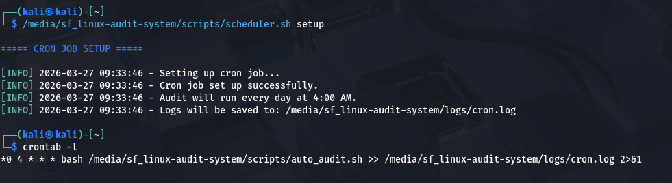

# Technical Report
## Linux System Audit and Monitoring using Shell Scripting

**Project:** Mini-Project Part 1
**Course:** Operating Systems — Foundation Training
**Institution:** National School of Cyber Security (NSCS), Algeria
**Academic Year:** 2025/2026
**Supervisor:** Dr. BENTRAD Sassi
**Students:** Karim — Abderrahim
**Submission Date:** March 30, 2026

---

## 1. Introduction

System auditing is a fundamental practice in cybersecurity and system administration. It involves collecting detailed information about a machine's hardware and software state, which is essential for vulnerability assessment, incident response, asset inventory management, and compliance verification. Manual auditing is inefficient and error-prone, especially across multiple machines.

This project addresses that problem by implementing a fully automated Linux audit and monitoring system built entirely in Bash shell scripting. The system collects hardware and software information, generates structured reports in multiple formats, sends them by email, supports remote monitoring over SSH, and automates all execution through cron jobs.

The solution runs on standard Linux distributions such as Ubuntu and Kali Linux, uses only built-in Linux tools, and requires no external heavy frameworks.

---

## 2. System Design

### 2.1 Design Principles

The system was designed around three core principles:

**Modularity:** Each script handles exactly one responsibility. This makes the system easier to test, maintain, and extend without breaking other parts.

**Portability:** Every function that relies on an external command first verifies that the command exists before calling it. If a command is missing, the script falls back to an alternative or logs a warning and continues. This ensures the system works across different Linux distributions and minimal installations.

**Security:** Sensitive data such as SMTP credentials are stored in a separate configuration file (`email.conf`) that is gitignored and never pushed to version control. All configuration values are centralized in `config/` rather than hardcoded in scripts.

### 2.2 Architecture Overview

The system is composed of nine scripts and two configuration files:

| File | Responsibility |
|---|---|
| `utils.sh` | Shared colors, logging functions, error handling — sourced by all scripts |
| `hardware_audit.sh` | Collects CPU, GPU, RAM, Disk, Network, USB, Motherboard information |
| `software_audit.sh` | Collects OS info, kernel, packages, users, services, ports, startup programs |
| `report_generator.sh` | Generates short and full reports in .txt, .html, .json formats |
| `email_sender.sh` | Sends reports by email using msmtp, sendmail, or mail |
| `remote_monitor.sh` | Remote monitoring and report transfer via SSH and SCP |
| `scheduler.sh` | Sets up, removes, and checks the status of the cron job |
| `auto_audit.sh` | Silent entry point called by cron — runs full pipeline without interaction |
| `main.sh` | Interactive menu entry point for manual use |
| `config/audit.conf` | Main configuration: paths, thresholds, remote settings |
| `config/email.conf` | Email credentials — gitignored |

### 2.3 Two Operating Modes

The system operates in two distinct modes:

**Manual mode:** The user runs `bash scripts/main.sh` which presents an interactive menu with nine options covering hardware audit, software audit, report generation, email sending, remote monitoring, report comparison, CPU alert check, and log integrity verification.

**Automated mode:** The cron job calls `auto_audit.sh` daily at 4:00 AM. This script runs silently with no user interaction: it collects hardware data, collects software data, generates a full report in all three formats, and sends it by email. Execution output is redirected to `logs/cron.log`.


---

## 3. Implementation

### 3.1 Shared Utilities — `utils.sh`

`utils.sh` is the foundation of the system. It is sourced by every other script and provides shared functionality that would otherwise be duplicated across all modules.

A source guard at the top prevents it from being executed more than once even when multiple scripts source it in the same session:

```bash
[[ -n "${_UTILS_LOADED:-}" ]] && return 0
_UTILS_LOADED=1
```

It provides ANSI color variables for terminal output (RED, GREEN, YELLOW, BLUE, CYAN, BOLD, RESET), three logging functions that print colored messages and append them to a log file simultaneously using `tee -a`, a `timestamp()` function that returns the current datetime, a `check_command()` function that verifies a command exists before use, a `check_root()` function that warns when not running as root, and formatting helpers `print_section()` and `separator()`.

The log file path is resolved using `BASH_SOURCE[0]` which always points to `utils.sh` itself regardless of which script sourced it, ensuring the log directory is always found correctly.

### 3.2 Hardware Audit — `hardware_audit.sh`

This module collects information about all hardware components. Each component has its own function:

| Function | Primary Command | Fallback |
|---|---|---|
| `get_cpu_info()` | `lscpu` | `/proc/cpuinfo` |
| `get_gpu_info()` | `lspci \| grep -i vga` | None — optional |
| `get_ram_info()` | `free -h` | `/proc/meminfo` |
| `get_disk_info()` | `lsblk -o NAME,SIZE,FSTYPE,MOUNTPOINT,TYPE` | `fdisk -l` |
| `get_network_info()` | `ip -br addr show` + `ip link show` | `ifconfig -a` |
| `get_motherboard_info()` | `dmidecode -t baseboard` | None — requires root |
| `get_usb_info()` | `lsusb` | None — optional |

The `hardware_audit()` wrapper function calls all of them in order and is what `main.sh` and `auto_audit.sh` invoke.

Notable implementation detail: `get_disk_info()` calls both `lsblk` (which shows device tree and filesystem types) and `df -h` (which shows actual usage percentages). Both are needed to satisfy the requirement of reporting size, partitions, usage, and filesystem type.

### 3.3 Software Audit — `software_audit.sh`

This module extracts OS and software information:

| Function | Primary Command | Fallback |
|---|---|---|
| `get_os_info()` | `lsb_release -a` | `/etc/os-release` |
| `get_kernel_info()` | `uname -r` | `/proc/version` |
| `get_arch_info()` | `uname -m` | `/proc/version` |
| `get_installed_packages()` | `dpkg -l` | `rpm -qa` |
| `get_logged_in_users()` | `who` | None |
| `get_services_info()` | `systemctl list-units --state=running` | `service --status-all` |
| `get_open_ports()` | `ss -tuln` | `netstat -tuln` |
| `get_startup_programs()` | `systemctl list-unit-files \| grep enabled` | `chkconfig --list` |

The `get_services_info()` function also runs `ps aux --sort=-%cpu | head -20` to capture the top 20 active processes sorted by CPU usage, satisfying both the "running services" and "active processes" requirements in a single function.

The `get_installed_packages()` function handles both Debian-based systems (Ubuntu, Kali) using `dpkg` and RPM-based systems (CentOS, Fedora) using `rpm`, making the script distribution-agnostic.


### 3.4 Report Generation — `report_generator.sh`

The reporting system generates two types of reports in multiple formats.

**Short report** (`generate_short_report()`): Produces a concise `.txt` summary containing OS info, CPU model and core count, RAM usage, disk usage per partition, and IP addresses. Saved with a timestamp in the filename: `short_report_YYYY-MM-DD_HH-MM-SS.txt`.

**Full report** (`generate_full_report()`): Produces three files simultaneously from the same data collection pass:

- `.txt` — complete plain text report with all hardware and software sections
- `.html` — styled dark-theme web page with syntax-highlighted sections, viewable in any browser
- `.json` — machine-readable structured object containing key system identifiers

All reports include a header with the date, hostname, and current user. They are saved to the directory defined in `REPORT_DIR` inside `audit.conf`.

The module also implements three bonus features: `compare_reports()` which uses `diff` to detect changes between two report files, `check_cpu_alert()` which reads CPU idle time and triggers a warning when usage exceeds the configured threshold, and `verify_integrity()` which uses `sha256sum` to generate and verify checksums of all report files to detect tampering.

### 3.5 Email Transmission — `email_sender.sh`

The email module automatically detects which email tool is available on the system in priority order: `msmtp` first, then `sendmail`, then `mail`. This makes it work across different system configurations without manual selection.

Two send functions are provided:

`send_report()` is interactive — it presents a menu asking the user which report to send (short .txt, full .txt, or full .html), confirms the recipient, then sends it.

`send_report_auto()` is fully silent — it picks the latest full report automatically and sends it without any prompts. This is the function called by `auto_audit.sh` during automated cron runs.

Both functions use the `send_ok=1/0` pattern to track success without relying on `$?`, which is unreliable under `set -euo pipefail`.

Email configuration is stored entirely in `config/email.conf` and includes `SMTP_HOST`, `SMTP_PORT`, `SMTP_USER`, `SMTP_PASSWORD`, `EMAIL_SENDER`, and `EMAIL_RECIPIENT`. At runtime, the script dynamically constructs a temporary `msmtp` configuration file from those variables, uses it for the current send operation, then immediately deletes it. This means no manual `~/.msmtprc` file is required from the administrator. For Gmail, an App Password must be generated from Google Account settings since direct account password authentication over SMTP is disabled by Google.

### 3.6 Automation — `scheduler.sh` and `auto_audit.sh`

`scheduler.sh` manages the cron job with three subcommands:

```bash
bash scripts/scheduler.sh setup   # add cron job
bash scripts/scheduler.sh remove  # remove cron job
bash scripts/scheduler.sh status  # check if active
```

The cron job entry added to the user's crontab:

```
0 4 * * * bash /absolute/path/to/scripts/auto_audit.sh >> /absolute/path/to/logs/cron.log 2>&1
```

This runs `auto_audit.sh` every day at 4:00 AM. Absolute paths are required because cron runs in a minimal environment without the user's PATH. `2>&1` redirects both standard output and error output to the same log file so nothing is lost silently.

`auto_audit.sh` is a dedicated silent pipeline script. It does not open any menus or wait for any input. It sources all required modules and runs: `hardware_audit()` → `software_audit()` → `generate_full_report()` → `send_report_auto()`. Any failure stops execution immediately due to `set -euo pipefail` and is recorded in the cron log.

### 3.7 Remote Monitoring — `remote_monitor.sh`

The remote monitoring module uses SSH and SCP to interact with remote machines. Before attempting any operation it calls `test_ssh_connection()` which uses `ssh -o BatchMode=yes` to verify connectivity without prompting for a password, requiring SSH key-based authentication.

Three operations are available:

**Monitor remote machine:** Connects via SSH and runs a set of diagnostic commands on the remote machine including CPU usage from `top`, memory from `free -h`, disk usage from `df -h`, logged-in users from `who`, top 5 processes from `ps aux`, and open ports from `ss -tuln`. The output streams back to the local terminal in real time.

**Send report to remote server:** Uses `scp` to copy the latest local report to the remote machine. The destination directory is created automatically via SSH before the transfer if it does not already exist.

**Both:** Performs monitoring then transfers the report in sequence.


---

## 4. Key Commands Used

### Hardware Collection

| Command | Purpose |
|---|---|
| `lscpu` | CPU model, architecture, core and thread count |
| `grep -E 'model name\|cpu cores' /proc/cpuinfo` | Fallback CPU info from kernel file |
| `lspci \| grep -i vga` | GPU detection |
| `free -h` | RAM total, used, and free in human-readable format |
| `grep MemTotal /proc/meminfo` | Fallback RAM info from kernel file |
| `lsblk -o NAME,SIZE,FSTYPE,MOUNTPOINT,TYPE` | Disk layout, filesystem types, mount points |
| `df -h` | Disk usage percentages per partition |
| `fdisk -l` | Fallback disk info |
| `ip -br addr show` | Network interfaces and IP addresses in brief format |
| `ip link show \| grep link/ether` | MAC addresses |
| `dmidecode -t baseboard` | Motherboard manufacturer, product, version (requires root) |
| `lsusb` | Connected USB devices |

### Software Collection

| Command | Purpose |
|---|---|
| `lsb_release -a` | OS name, version, codename |
| `grep PRETTY_NAME /etc/os-release` | Fallback OS identification |
| `uname -r` | Kernel version |
| `uname -m` | System architecture |
| `dpkg -l` | List all installed packages (Debian/Ubuntu/Kali) |
| `rpm -qa` | List all installed packages (RPM-based distros) |
| `who` | Currently logged-in users |
| `systemctl list-units --type=service --state=running` | Active systemd services |
| `ps aux --sort=-%cpu \| head -20` | Top 20 processes by CPU usage |
| `ss -tuln` | Listening TCP and UDP ports |
| `systemctl list-unit-files --type=service \| grep enabled` | Services enabled at boot |

### Automation and Security

| Command | Purpose |
|---|---|
| `crontab -l` | List current cron jobs |
| `crontab -e` | Edit cron jobs |
| `(crontab -l 2>/dev/null \|\| true; echo "$CRON_JOB") \| crontab -` | Add cron job without overwriting existing ones |
| `ssh -o BatchMode=yes -o ConnectTimeout=5` | Test SSH connection without password prompt |
| `scp -o ConnectTimeout=10` | Secure file copy to remote server |
| `sha256sum` | Generate and verify file checksums for integrity checking |
| `diff --color=always` | Compare two report files and highlight differences |
| `tee -a "$LOG_FILE"` | Print to terminal and append to log file simultaneously |

---

## 5. Cron Configuration

The cron job is managed by `scheduler.sh`. After running `bash scripts/scheduler.sh setup`, the following entry is added to the user's crontab (viewable with `crontab -l`):

```
0 4 * * * bash /home/user/linux-audit-system/scripts/auto_audit.sh >> /home/user/linux-audit-system/logs/cron.log 2>&1
```

**Field breakdown:**

| Field | Value | Meaning |
|---|---|---|
| Minute | `0` | At minute zero |
| Hour | `4` | At 4 AM |
| Day of month | `*` | Every day |
| Month | `*` | Every month |
| Day of week | `*` | Any weekday |

The `>>` operator appends execution output to the log file rather than overwriting it, preserving audit history. `2>&1` ensures error output is captured alongside normal output so failures are never lost silently.



---

## 6. Security Considerations

**Credential separation:** SMTP credentials are stored exclusively in `config/email.conf` which is listed in `.gitignore`. This file is never pushed to version control. The repository only contains a template with placeholder values.

**Principle of least privilege:** The system does not require root access to function. Most commands run as a regular user. Functions that require root such as `dmidecode` handle the permission error gracefully using `2>/dev/null` and display a warning instead of crashing.

**SSH key-based authentication:** The remote monitoring module uses `ssh -o BatchMode=yes` which disables password prompts entirely. This enforces key-based authentication for all remote operations, preventing password exposure.

**Input validation:** All user inputs in interactive menus are validated before being used. Empty inputs, invalid choices, and missing files are all handled with appropriate error messages.

**Log integrity:** The `verify_integrity()` function uses `sha256sum` to generate checksums of all report files. These checksums can later be verified to detect any unauthorized modification of audit logs, which is a basic tamper detection mechanism.

**Error handling:** All scripts use `set -euo pipefail` which causes immediate exit on any unhandled error, undefined variable reference, or pipe failure. This prevents scripts from continuing in an undefined state after a failure.

---

## 7. Challenges Encountered

**Cron calling an interactive script:** The initial design pointed the cron job at `main.sh` which opens an interactive menu. This is completely useless in an automated context since there is no human to interact with it. The solution was to create a dedicated `auto_audit.sh` script that runs the full audit pipeline silently with no interaction, and redirect the cron job to call that instead.

**`set -euo pipefail` breaking `grep` in conditions:** `grep` returns exit code 1 when it finds no matches, which `set -e` interprets as a failure and kills the script. This required adding `|| true` after grep calls that are expected to sometimes find nothing, such as filtering for running services or GPU devices.

**Sourcing the same file multiple times:** When `auto_audit.sh` sources `hardware_audit.sh`, `software_audit.sh`, `report_generator.sh`, and `email_sender.sh`, and each of those independently sources `utils.sh`, it gets executed multiple times. The solution was a load guard at the top of `utils.sh` using a flag variable `_UTILS_LOADED` that causes the file to return immediately on subsequent sources.

**`$?` unreliable under `set -euo pipefail`:** When checking if an email was sent successfully using `if [[ $? -eq 0 ]]`, the script exits before reaching that check if the command failed. The solution was to use `command && send_ok=1 || send_ok=0` which captures success or failure without triggering the exit-on-error behavior.

**Windows line endings:** Developing on Windows with Git Bash causes scripts to be saved with CRLF line endings instead of LF. Bash on Linux cannot parse CRLF files correctly. Git was configured to handle this automatically through `.gitattributes` settings.

**Absolute paths in cron:** Cron runs in a minimal environment with a restricted PATH. Using relative paths or relying on PATH-dependent commands causes silent failures. All paths in the cron job and in `scheduler.sh` are resolved to absolute paths using `$(cd "$(dirname "${BASH_SOURCE[0]}")" && pwd)`.

---

## 8. Work Distribution

| Task | Person |
|---|---|
| `utils.sh` — shared utilities and logging | Karim |
| `hardware_audit.sh` — hardware data collection | Karim |
| `software_audit.sh` — software and OS collection | Karim |
| `scheduler.sh` — cron job management | Karim |
| `config/audit.conf` — main configuration | Karim |
| `tests/test_hardware.sh` — hardware tests | Karim |
| `tests/test_software.sh` — software tests | Karim |
| `docs/design_architecture.md` — architecture doc | Karim |
| `main.sh` — interactive menu | Abderrahim |
| `report_generator.sh` — report generation | Abderrahim |
| `email_sender.sh` — email transmission | Abderrahim |
| `remote_monitor.sh` — SSH remote monitoring | Abderrahim |
| `README.md` — project documentation | Abderrahim |
| `auto_audit.sh` — cron pipeline script | Both |
| Integration testing and bug fixing | Both |
| Presentation and demonstration | Both |

---

## 9. Conclusion

This project successfully implements a complete Linux audit and monitoring system that meets all requirements defined in the project specification. The system collects detailed hardware and software information, generates structured reports in three formats, sends them by email, supports remote monitoring via SSH, and automates execution through cron.

Beyond the base requirements, several bonus features were implemented including colorized terminal output, an interactive menu, CPU threshold alerting, report comparison using diff, and log integrity verification using sha256sum.

The modular architecture and consistent error handling make the system reliable across different Linux distributions and environments, and the security-conscious design ensures sensitive data is never accidentally exposed through version control.
